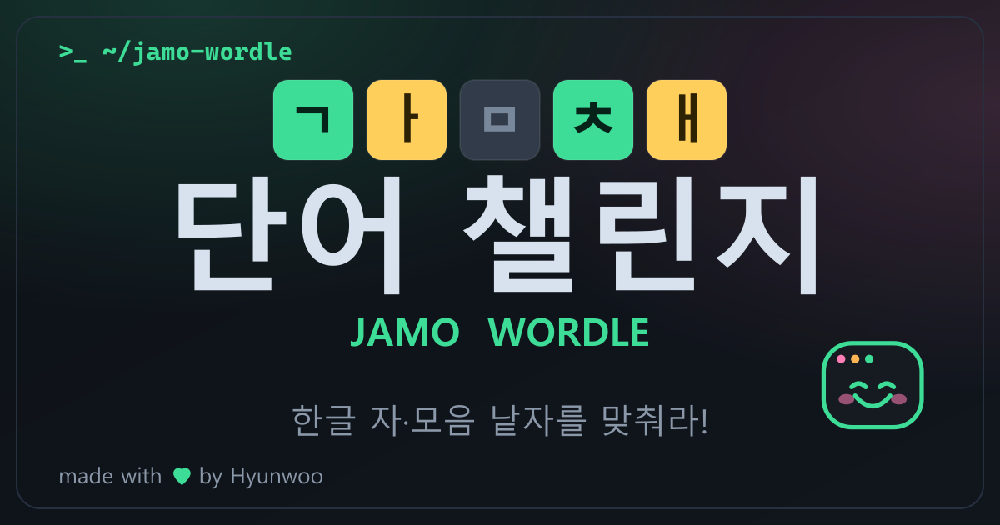

<div align="center">



# 단어 챌린지 · 자모 워들 (Jamo Wordle) ᕕ( ᐛ )ᕗ

**한글 자음·모음 낱자를 맞추는 워들 게임**

React (Vite) · Firebase (Hosting · Firestore · Anonymous Auth)

</div>

---

## ✨ 특징

- **한글 자모 분리 플레이** — 완성형 한글을 초/중/종성 낱자로 분해해 맞춘다.
  - 예) `녹차` → `ㄴ ㅗ ㄱ ㅊ ㅏ` (5칸)
  - **쌍자음 규칙**: `ㄲ·ㄸ·ㅃ·ㅆ·ㅉ`은 기본 자음 2칸으로 입력 (예) `토끼` → `ㅌ ㅗ ㄱ ㄱ ㅣ`
  - 겹받침(`ㄳ·ㄵ·ㄺ`…)도 구성 자음으로 분해
- **판정 시스템** — 🟩 자모O·위치O / 🟨 자모O·위치X / ⬛ 자모X (중복 자모 정확 처리)
- **가상 키보드** — 자모 전용 키보드에 판정색 실시간 반영 + 물리 키보드(두벌식) 지원
- **스테이지 진행** — 5칸 기본 클리어 시 **6칸 챌린지** 모드 해금 (스테이지별 독립 시간 측정)
- **실시간 익명 랭킹** — 로그인 없이 닉네임만으로 등록, Firestore `onSnapshot` 실시간 Top 10
  - 정렬: ① 스테이지(6칸 > 5칸) ② 시도 횟수 적은 순 ③ 걸린 시간 짧은 순
  - 5칸 / 6칸 랭킹 **분리 표시**
- **📅 데일리 챌린지** — KST 날짜 기준 모두 같은 '오늘의 단어', **닉네임당 하루 1회**(문서ID 잠금), 데일리 전용 랭킹 + 다음 챌린지 카운트다운. 이미 참여했으면 랭킹 열람만.
- **📋 결과 공유** — 정답 노출 없이 이모지 판정 그리드(🟩🟨⬛) 복사/공유 (Web Share API)
- **💡 힌트** — 스테이지당 1회, 다음 칸 정답 자모 공개 (+30초 페널티)
- **📊 개인 통계** — 플레이/승률/연속(스트릭)/시도 횟수 분포 (localStorage)
- **📖 사전 검증** — 실제 국어사전 기반 약 5.7만 단어로 제출 단어 검사, 없는 단어는 행 초기화
- **📱 PWA** — 설치형 앱(홈화면 추가), 서비스워커 오프라인 앱셸, 마스코트 앱 아이콘
- **모바일 완벽 대응** — 반응형 레이아웃, safe-area, 동적 뷰포트, 터치 최적화, 두벌식 키보드
- **치팅 방지** — 정답을 상태에 평문으로 두지 않고 난독화해 개발자 도구 훔쳐보기 차단

## 🛠 기술 스택

| 구분 | 사용 |
|------|------|
| 프레임워크 | React 18 + Vite 5 |
| 백엔드 | Firebase Firestore · Anonymous Auth · Hosting |
| 스타일 | CSS Modules (터미널 네온 테마) |
| 폰트 | JetBrains Mono(Nerd Font 대체) + Gothic A1 |

## 🚀 실행

```bash
# 1) 의존성 설치
npm install

# 2) 개발 서버
npm run dev            # http://localhost:5173

# 3) 프로덕션 빌드
npm run build          # → dist/

# 4) 로컬 미리보기
npm run preview
```

### 환경변수 (선택)

`.env.example`를 복사해 `.env`를 만들면 Firebase 설정을 덮어쓸 수 있다.
(웹 config는 비밀이 아니며, 미설정 시 `src/firebase.js`의 기본값으로 동작한다.)

```bash
cp .env.example .env
```

## ☁️ 배포 (Firebase Hosting)

```bash
# 최초 1회: Firebase CLI 로그인
npm i -g firebase-tools
firebase login

# 빌드 + 호스팅 배포
npm run deploy         # = vite build && firebase deploy --only hosting

# 보안 규칙 + 랭킹 인덱스 배포
firebase deploy --only firestore
```

> ⚠️ **콘솔 필수 설정 2가지**
> 1. **Authentication → 로그인 방법 → 익명(Anonymous) 사용 설정** (랭킹 등록에 필요)
> 2. 랭킹 정렬용 **복합 인덱스**가 필요하다. `firebase deploy --only firestore:indexes`로 배포하거나,
>    최초 실행 시 브라우저 콘솔에 찍히는 "인덱스 생성" 링크를 클릭하면 자동 생성된다.

## 📁 구조

```
src/
├─ main.jsx                 # 엔트리
├─ App.jsx                  # 화면 조립(인트로/게임/결과/등록 모달)
├─ firebase.js              # Firebase 초기화 + 익명 로그인
├─ hooks/
│  └─ useWordleGame.js      # 게임 상태·규칙·타이머·모드 전환
├─ utils/
│  ├─ hangul.js             # 자모 분해 + 워들 판정 (핵심 로직)
│  ├─ secret.js             # 정답 난독화(anti-peek)
│  └─ format.js             # 시간/순위 포맷
├─ constants/words.js       # 단어 풀(길이·키보드 자동 검증)
├─ services/ranking.js      # Firestore 랭킹 제출/구독
├─ components/              # Board · Keyboard · Leaderboard · Modal · Mascot · Intro · Confetti
└─ styles/                  # CSS Modules
```

## 🔒 치팅 방지에 대하여

순수 클라이언트 게임은 판정을 위해 브라우저가 정답을 알아야 하므로 **완벽 차단은 서버 판정(Cloud Functions)**이 필요하다.
본 프로젝트는 정답을 상태에 **난독화(XOR+Base64)**해 보관하고 판정 순간에만 잠깐 복호화하므로,
React DevTools·콘솔에서 정답을 평문으로 훔쳐보는 캐주얼 치팅을 효과적으로 차단한다.
더 강한 보증이 필요하면 서버 판정 API로 확장하면 된다.

---

<div align="center">
made with 💚 by <b>Hyunwoo</b> · Hyun-woo Bae (Jeju, KR)
</div>
